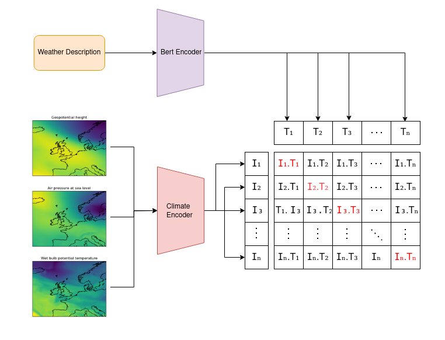
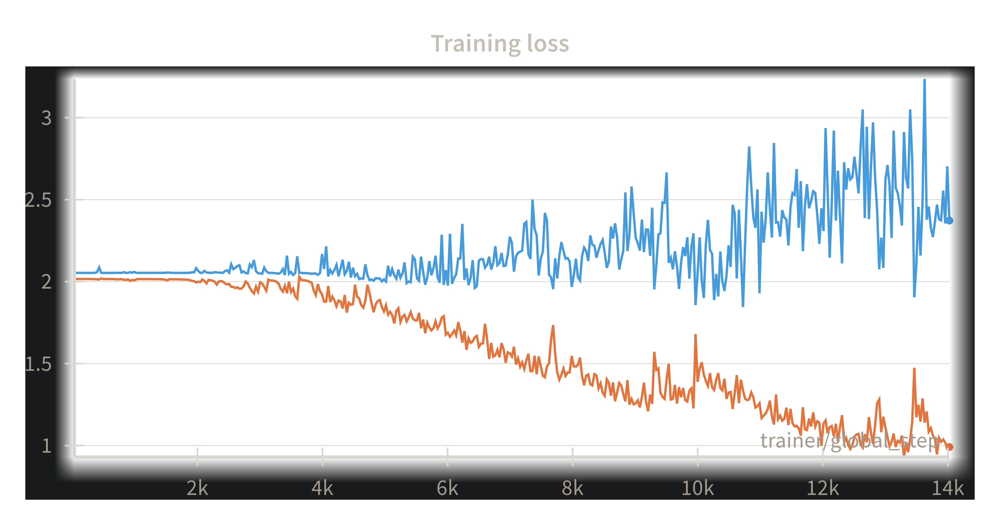

# Environmental Intelligence Hackathon 2025

This project involved multi-modal Met Office weather data. Which consisted of climate data (air pressure at sea level, wet bulb potential temperature, and geopotential height), and corresponding text descriptions of the data in the form of pdf reports. This required a substantial amount of pre-processing in order to collate climate data with the pdfs. There are notebooks that have preprocessing steps in in order to get the text and climate npy data aligned in a dataset.csv

Then main model was CLIP inspired, where we implemented a contrastive loss to embed climate data in the same vector space as descriptions.

##Model Architecture

###Model Training

Legend:
  - orange: training
  - blue: validation

## Instructions

Once the repo has been cloned, create a data/EIB2025 directory and put the dataset.csv and npy files within. You can just put it in data but just make sure you account for this change in metdataset.py.  

After creating the conda environment, just execute: python src/train.py

Our team:

Oscar: <oh396@exeter.ac.uk>  
Selorm: <sd923@exeter.ac.uk>  
Nuria: <nb748@exeter.ac.uk>  
Joshua: <jd983@exeter.ac.uk>  
Arjun: <ab1574@exeter.ac.uk>  
